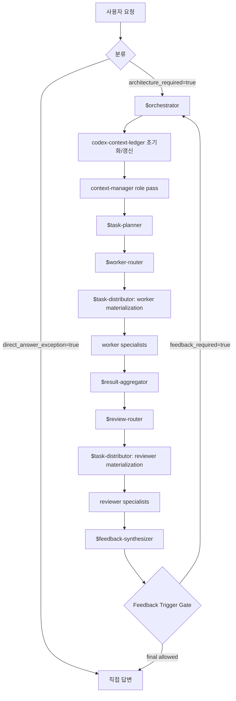

# 런타임 오케스트레이션 절차

> [!important]
> 실제 절차 원본은 `C:\Users\junsu\.codex\agent-architecture\09-runtime-orchestration-steps.md`다. 이 문서는 그 내용을 한국어로 풀어서 설명한다.

## 시작 조건

작업은 먼저 direct-answer인지 architecture-required인지 분류한다.

단순 번역, 짧은 명령 출력, 매우 작은 설명은 direct-answer로 끝낼 수 있다. 하지만 다음에 해당하면 `architecture_required=true`로 간주한다.

- architecture, orchestration, harness, agent structure, feedback gate를 명시적으로 언급
- non-trivial audit
- 구현 또는 수정
- 조사, 비교, 설계 판단
- risky 작업
- multi-agent 또는 multi-artifact 작업

architecture-required가 되면 `09-runtime-orchestration-steps.md`의 순서를 건너뛰면 안 된다. 유효한 feedback judgment가 loop를 막거나 direct-answer exception이 명시될 때만 예외다.

## 전체 흐름

## Startup Gate

1. 요청을 분류한다.
2. architecture-required이면 `architecture_required=true`를 기록한다.
3. substantive work 전에 MCP를 사용한다.
4. `orchestrator`, `context-manager`, `aggregator`, `review-router`, reviewer lanes, `meta-judge`는 `MCP_DOCKER/sequentialthinking:success` evidence가 필요하다.
5. `$orchestrator`를 활성화해 `run_id`, `loop_id`, `loop_attempt`, `context_packet_version`, 기본 `fanout_budget`을 잡는다.
6. `codex-context-ledger` MCP run entry를 초기화하거나 갱신한다.

## Control Loop 상세

### 1. `$orchestrator`

`$orchestrator`는 사용자의 목표, 허용 scope, 제외 scope, 위험, 성공 기준, feedback carryover를 정리한다. output은 `orchestration_request`다.

이 단계가 만들면 안 되는 것:

- `context_packet`
- `execution_plan`
- `launch_manifest`
- `aggregation_packet`
- `judgment_envelope`

이 금지는 stage 간 책임을 분리하기 위한 것이다.

### 2. context-manager role pass

현재 구조에서 context manager는 물리 resident agent가 아니다. main agent가 context-manager role pass를 수행하면서 `codex-context-ledger` MCP를 읽고 쓴다.

이 단계가 만드는 것은 `context_packet`이다. `context_packet`에는 승인된 사실, artifact inventory, stale markers, constraints, role pass readiness가 들어간다.

### 3. `$task-planner`

`$task-planner`는 `context_packet`을 `execution_plan`으로 바꾼다. 실행 가능한 lane, 파일 소유권, merge point, expected artifact, review hint, direct blocker를 정의한다.

planner는 worker를 spawn하지 않는다. router도 실행하지 않는다. 계획만 만든다.

### 4. `$worker-router`

`$worker-router`는 `execution_plan`을 worker `launch_manifest`로 바꾼다. 이때 반드시 `agents/<category>/*.toml` 전체 specialist catalog를 enumerate해야 한다.

router는 logical manifest만 만든다. `spawn_agent`, `wait_agent`, `close_agent`를 호출하지 않는다.

### 5. `$task-distributor` worker wave

`$task-distributor`는 validated worker `launch_manifest`를 받아 실제 child agent를 만든다.

기록해야 하는 값:

- `spawn_receipt_ref`
- `agent_id`
- `submission_id`
- `wait_handle`
- `wait_agent` evidence
- lane status classification

### 6. worker specialists

worker specialist는 실제 구현, 분석, 수정, 테스트 작성 같은 bounded work를 수행한다. 결과는 `handoff_result`로 돌아와야 한다.

### 7. `$result-aggregator`

aggregator는 worker handoff result, active passes, missing lane classification을 읽고 하나의 `aggregation_packet`으로 정리한다.

unwaited lane이나 unclassified failure가 있으면 정상 aggregation으로 넘기면 안 된다.

### 8. `$review-router`

review router는 valid `aggregation_packet`을 받아 review `launch_manifest`를 만든다. worker router와 마찬가지로 specialist list를 다시 enumerate한다.

### 9. `$task-distributor` review wave

reviewer lane도 distributor가 물리 materialization한다. reviewer의 결과도 `handoff_result` 형태로 돌아와야 한다.

### 10. `$feedback-synthesizer`

`$feedback-synthesizer`는 meta-judge 주변 단계다. aggregation, review result, waiver, gate evidence를 모아 `judgment_envelope`과 `feedback_gate_evidence`를 만든다.

final output은 이 단계의 gate를 통과해야만 허용된다.

## Transition Gate

각 canonical artifact 뒤에는 다음 순서를 거쳐야 한다.

1. `validate-runtime-artifact.py`로 shape 검증
2. `harness_handoff.py`로 next owner 입력 포장
3. `harness_gate.py`로 next stage 허용 여부 판단
4. `stage_passes` 기록
5. stale context, missing provenance, open MCP, unwaited child, unclassified lane 차단

## Feedback Loop

`feedback_required=true`이면 final output은 금지된다. feedback은 항상 `orchestrator`로 돌아간다. 다음 loop는 MCP-backed context-manager role pass에서 새 `context_packet`을 만든 뒤 이어진다.

Resume은 prose memory가 아니라 run ledger, `stage_passes`, `active_passes`, `judgment_envelope`를 기준으로 해야 한다.
